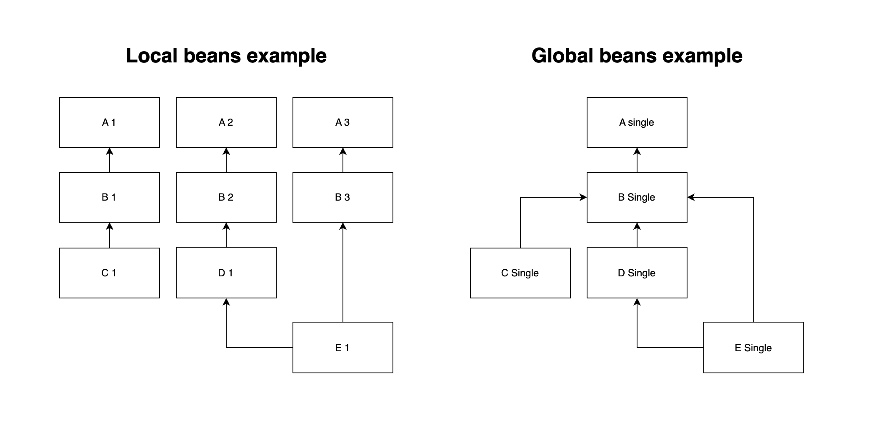
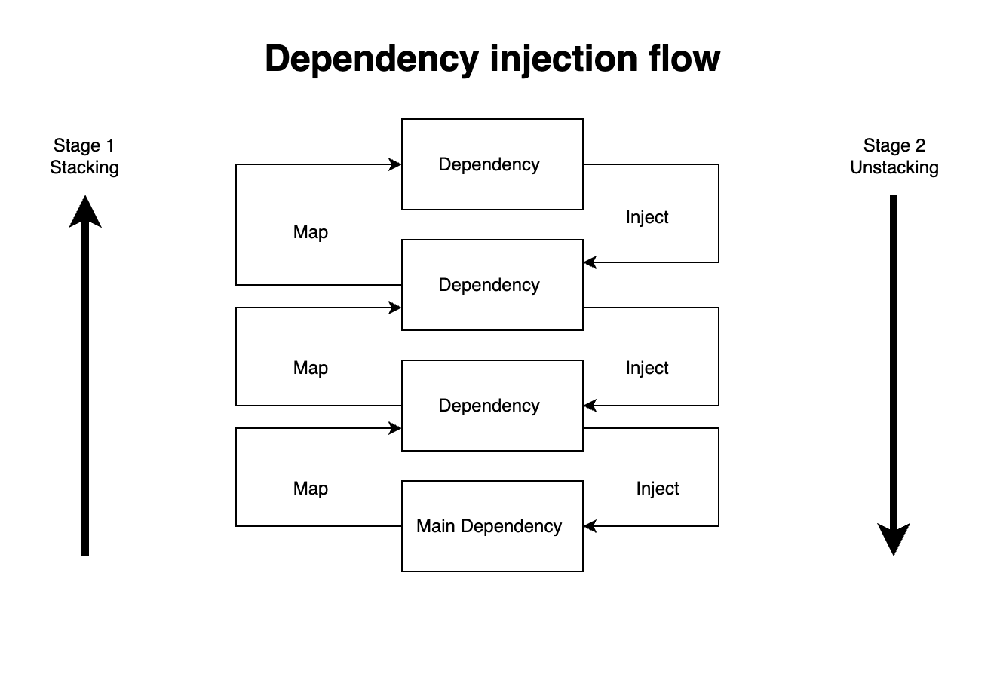

# Contêiner de injeção de dependência

Funcionalidades dessa versão:

 - Injeção automática de dependências 	
 - Identificação automática de implementação de interfaces 	
 - **Desambiguação** por meio de **metadados**

## Sobre o contêiner de injeção de dependência (DI)	
A struct `di.Container` representa um contêiner de injeção de dependências e é responsável por instanciar, configurar e montar os componentes mapeados na aplicação (beans). O contêiner recebe instruções sobre os componentes para instanciar, configurar e montar através de funções contrutoras e tags com metadados nas structs.

Exemplo básico:

    package  main
    
    import (
    "github.com/colibri-project-io/colibri-sdk-go/pkg/di"
    )
    
    type  Foo  struct {
    }

	func  main() {
	
    app  :=  di.NewContainer()
    app.AddDependencies(NewFoo)
    app.StartApp(InitializeAPP)
    }
    
    func InitializeAPP(f  Foo) string {
	    return  "Application started successfully!"
	}
	
	func NewFoo() Foo {
		return  Foo{}
    }

No exemplo acima, os construtores foram registrados no container por meio do método `AddDependencies`. Após o registro das dependências, inicia-se a aplicação por meio do método `StartApp`, que recebe como parâmetro uma função responsável por iniciar todo o fluxo da aplicação. Após o recebimento da função de inicialização do sistema, o container identifica e instancia, por meio dos parâmetros dos construtores, as dependências de cada objeto do sistema.

## Conceitos fundamentais
### Beans

Os objetos que formam a espinha dorsal da sua aplicação e que são gerenciados pelo contêiner de DI são chamados de beans. Um bean é um objeto instanciado, montado e gerenciado por um contêiner de DI.

Todos os Beans são construídos por uma função construtora.

Cada Bean possuí duas propriedades principais: um nome e um tipo.

Pode haver muitos beans do mesmo tipo, mas o nome do bean é único e é utilizado para identificá-lo.

Quanto ao seu comportamento, os beans podem ser classificados em dois tipos:

 - **Beans locais** são os beans que são criados no momento da injeção
 - **Beans globais** são os beans criados um única vez e injetados em vários outros beans

A tabela abaixo relaciona todas as propriedades dos beans:

| Propriedade | Descrição |
|--|--|
| IsFunction | Indica se o bean possuí somente um contrutor ou um objeto já instanciado |
| IsGlobal | Indica se o bean é global ou locsl |
| Name | O nome único do bean |
| constructorType | Objeto que carrega informações completas do construtor |
| fnValue | Objeto que carrega o contrutor para ser invocado na construção do objeto |
| constructorReturn | Objeto que carrega o tipo exato do construtor, usado para obter matadados |
| ParamTypes | Os parametros de contrução do bena |

### Construtores de beans

Contrutores são funções responsáveis por criar os beans.

Os contrutores de beans só podem ter 1 valor de retorno, que é o própio bean.

Os contrutores de beans devem obrigatoriamente receber outros benas como parametro ou não receber nenhum parametro (construtores raiz)

### Desambiguação

Durante o processo de mapeamento e injeção, caso seja encontrado mais de um construtor para um bean, usa-se os metadados das tags para descobrir qual deve ser injetado.

    type  BeanWithMetadata  struct {
    	f  BeanDependency  `di:"NewBeanDependency2"`
    }
    
    func  NewBeanDependency1() BeanDependency {
    	return  BeanDependency{}
    }
    
    func  NewBeanDependency2() BeanDependency {
    	return  BeanDependency{}
    }  

> **Observação:** a desambiguação não funciona em parâmetros variádicos
  
## Fluxo de funcionamento do contêiner

O container de injeção de dependência funciona por meio de um processo de empilhamento e desempilhamento(injeção). Na fase de empilhamento, são identificadas as dependências de um objeto e as dependências dessas dependências, em um ciclo recursivo que termina ao encontrar objetos que não necessitam de injeção de dependência. Na fase de injeção, os objetos mapeados na pilha são criados de forma que os objetos no topo da pilha são utilizados como parâmetros para a criação dos objetos nas camadas inferiores.

1. Registram-se os construtores responsáveis por criar todas as dependências da aplicação. As dependências criadas pelos construtores e injetadas nos parâmetros de outros construtores são chamadas de beans.

2. Registra-se a função responsável por iniciar todo o fluxo aplicação.

3. Identifica-se os beans que essa função recebe como parametro.

4. Procura-se no registro de contrutuores os contrutores desse beans.

	1. Caso esses contrutores também recebam outros benas como párametros vai se iniciar um ciclo recursivo de procura de bens e identificação de construtores.

	2.  Esse ciclo se encerra quando se encontram os contrutores que não recebem parametros (contrutores raiz) ou um bean global.

	3. Caso seja encontrado mais de um construtor para um bean, usa-se os metadados das tags para descobrir qual deve ser injetado.

5. Quando se encontram os beans raiz (aqueles que não posuuem parametro), a recursividade da função termina ese inicia o processo de contrução de objetos.